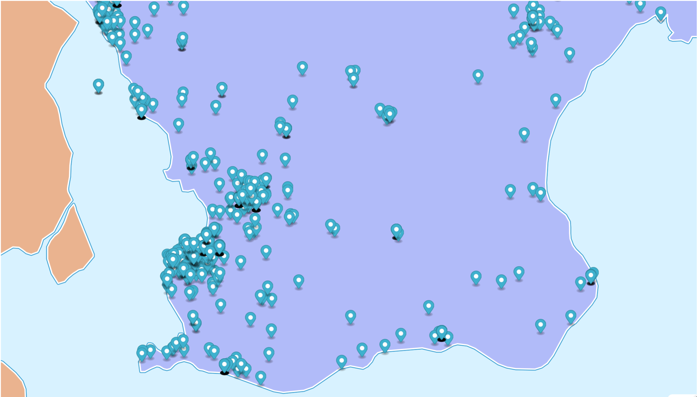
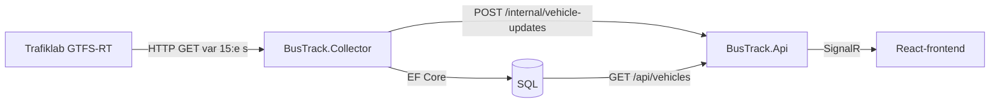
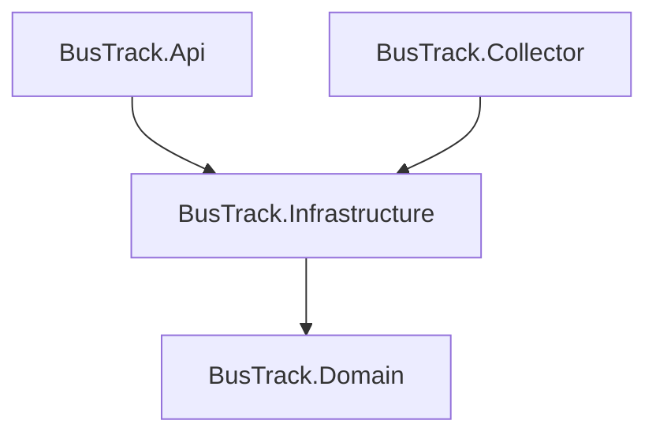

# BusTrack

Skånetrafikens bussar i realtid på en karta – från öppen GTFS-Realtime-data till levande markörer i webbläsaren.

Portfolioprojekt av **Peter Larsson** som visar C#/.NET 10, ASP.NET Core, Entity Framework Core, SQL, SignalR och React/TypeScript hela vägen från extern datakälla till frontend.



## Vad den gör

- **Collector** (en .NET Worker Service) hämtar Skånetrafikens fordonspositioner från Trafiklab var 15:e sekund, sparar dem i SQL och skickar dem vidare till API:et.
- **API:et** exponerar senaste position per fordon via REST och pushar nya positioner till alla uppkopplade webbläsare via SignalR.
- **Frontend** (React + MapLibre GL) visar varje fordon med riktningspil, färg för rörelse eller stillastående och en popup med hastighet.

## Arkitektur



Lösningen är uppdelad så att beroenden bara pekar inåt:



| Projekt | Ansvar |
| --- | --- |
| `BusTrack.Domain` | Entiteter (POCOs) utan beroenden |
| `BusTrack.Infrastructure` | `BusTrackDbContext`, migrationer och GTFS-RT-klienten (protobuf) |
| `BusTrack.Collector` | Pollar Trafiklab, sparar och publicerar |
| `BusTrack.Api` | REST, SignalR-hub (`/hubs/vehicles`) och internt endpoint för Collector |
| `frontend/` | React, TypeScript, Vite, MapLibre GL |

Collector och API är separata processer – den ena kan startas om utan att den andra påverkas.

## Designbeslut

- **Push i stället för polling.** SignalR ersatte frontendens polling, så fordonen rör sig så fort ny data finns.
- **Collector → API via ett internt HTTP-endpoint**, skyddat med en delad nyckel i headern. Enklast att resonera om lokalt, och `IHubContext` går över till Azure SignalR Service utan kodändring.
- **Senaste position per fordon i en SQL-fråga.** `GroupBy(...).First()` går inte att översätta i EF Core, så frågan är skriven som `MAX(Timestamp)` per fordon med join tillbaka.
- **Inaktiva fordon städas bort** både på servern (5 minuter) och i klienten (60 sekunder), så inga spökmarkörer blir kvar.

Hela resonemanget, plus en felsökningshistorik med elva verkliga problem och deras grundorsaker, finns i [`docs/BusTrack - Teknisk manual.docx`](docs/).

## Köra lokalt

**Krav:** .NET 10 SDK, Node.js, SQL Server (LocalDB räcker) och en gratis API-nyckel för [Trafiklab GTFS Sweden 3](https://www.trafiklab.se/api/gtfs-datasets/gtfs-sweden/).

**1. Hemligheter** (user-secrets, i respektive projektmapp):

```
cd src/BusTrack.Collector
dotnet user-secrets set "ConnectionStrings:BusTrackDb" "<connection string>"
dotnet user-secrets set "Trafiklab:VehiclePositionsUrl" "https://opendata.samtrafiken.se/gtfs-rt-sweden/skane/VehiclePositionsSweden.pb?key=<din nyckel>"
dotnet user-secrets set "Internal:SharedKey" "<valfri hemlig sträng>"

cd ../BusTrack.Api
dotnet user-secrets set "ConnectionStrings:BusTrackDb" "<samma connection string>"
dotnet user-secrets set "Internal:SharedKey" "<samma sträng som ovan>"
```

**2. Databasen:**

```
dotnet ef database update --project src/BusTrack.Infrastructure --startup-project src/BusTrack.Api
```

**3. Frontendens miljöfil:**

```
cd frontend
copy .env.example .env
```

`.env` pekar på API:et på `https://localhost:63364`.

**4. Starta i tre terminaler:**

```
dotnet run --project src/BusTrack.Api
dotnet run --project src/BusTrack.Collector
cd frontend && npm install && npm run dev
```

Öppna http://localhost:5173.

## Status

- [x] MVP: Collector → SQL → REST → karta
- [x] SignalR-push i stället för polling
- [x] Riktningspilar, popup med hastighet, städning av inaktiva fordon
- [ ] Azure-drift: Azure SQL, Azure SignalR Service, App Service eller Container Apps
- [ ] Statisk GTFS-data så att popupen visar linjenummer
- [ ] Städrutin för gammal positionsdata

## Datakälla

[Trafiklab GTFS Sweden 3](https://www.trafiklab.se/api/gtfs-datasets/gtfs-sweden/), CC0-licens.
